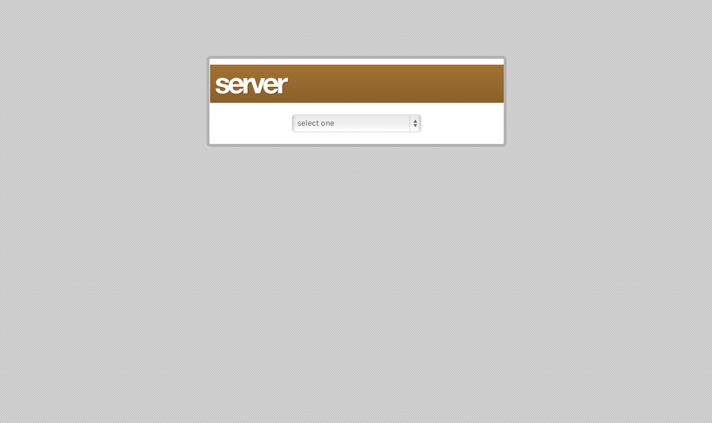
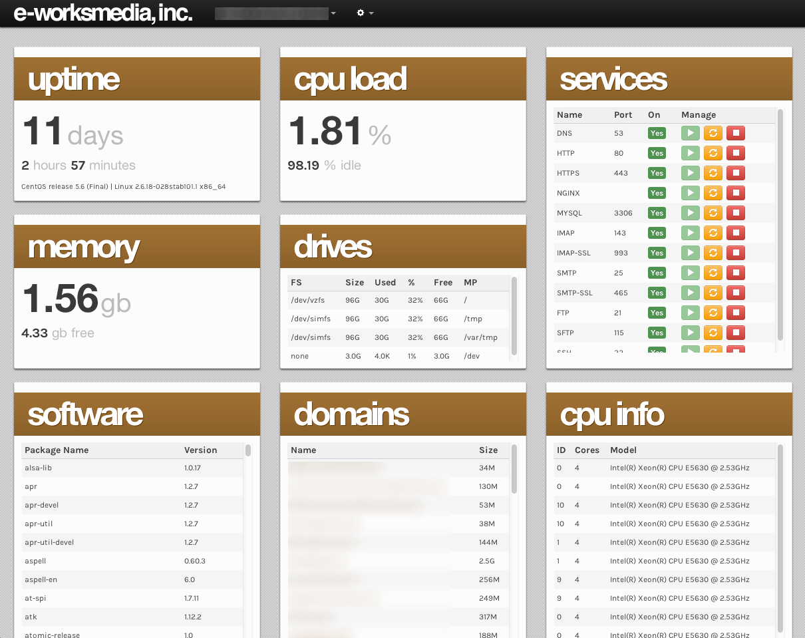
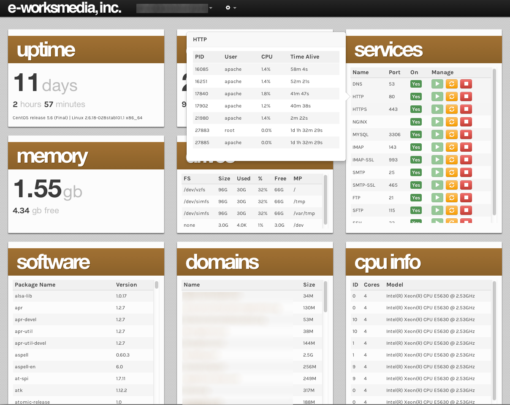
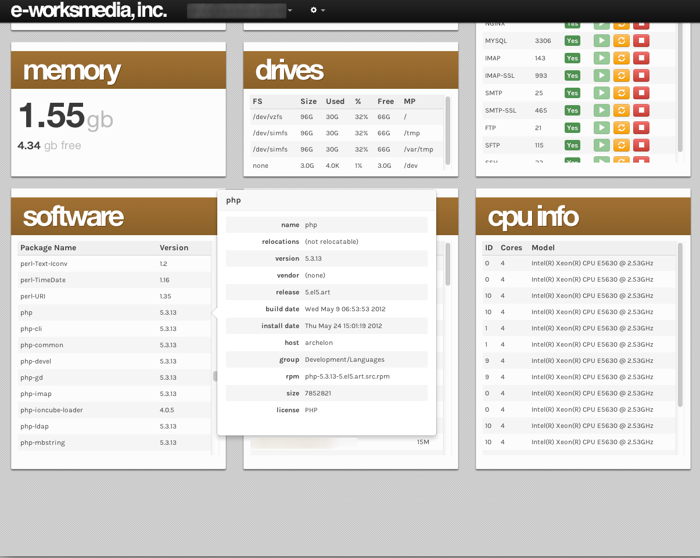
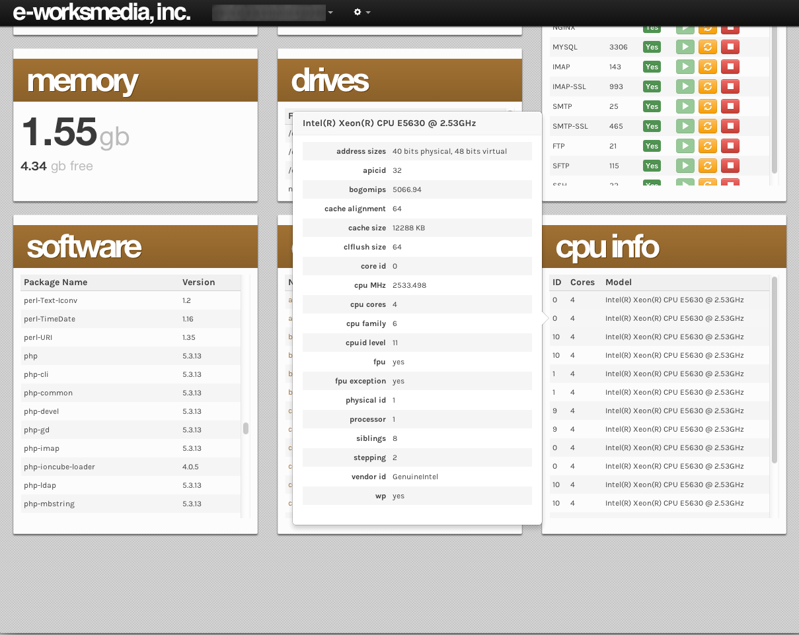

# PHP Server Status Dashboard

## Overview

PHP Server Status Dashboard is a collection of client and server software that make it easier to monitor your servers in near real-time. It impliments both Long Polling and [EventSource](http://www.w3.org/TR/eventsource/) (<https://github.com/Yaffle/EventSource/>) load methods. Currently, the EventSource load style is implemented using a Polyfill due to some bugs in the current versions of mainstream browsers dealing with CORS.

Server components (`Server.class.php`) were built on CentOS (RHEL) so some calls make use of RPM commands and would need to be translated to work in your environment. A binary wrapper is included to make calls from the dashboard to the server to start/restart/stop services as a pass-through for PHP. Source for the wrapper is included in 'build' in case you need to modify and re-compile it.

The software is setup to use Basic Authentication for accessing the server data. If you want to roll your own authentication system you'll want to make changes to the headers both load styles send as they currently send Authentication headers.

## Setup

### Server

- Copy contents of 'server' to a directory on your server.
- Setup Basic Authentication on directory
- Edit the header `Access-Control-Allow-Origin` in both `info.json.php` and `info.event.json.php` to match the domain your dashboard will live on.
- Edit the array of services to poll in `Server::getServicesInfo` in both `info.json.php` and `info.event.json.php`
- Edit the directory string and forbidden array in `Server::getDomainList` in both `info.json.php` and `info.event.json.php`. Directory string is a path to a directory containing your domains. Idealy, each domain will have a directory named after itself; /var/www/vhosts/domain1.com, /var/www/vhosts/domain2.com, etc. The forbidden array is a list of directory names to not include when traversing the main directory.
- Make any necessary changes to `Server.class.php` so that system calls will work on your setup. We've tested on CentOS 5.6 and CentOS 6.3.
- Upload it all
- Set permissions on `service.sh` to `chown root service.sh` and `chmod u=rwx,go=xr service.sh`
- Set permissions on `service` to `chown root service` and `chmod u=rwx,go=xr,+s service`

### Dashboard

- Copy contents of 'dashboard' to a directory on your server. Does not need to be the same server as above.
- Edit the list of available servers to poll in `application.js` under assets/scripts
- Default is set to use Long Polling at a 5 second interval. Change that on lines 73 and 74 of `application.js` if needed.
- Set Basic Authentication username and password on line 75 of `application.js`
- Upload it all

## Screenshots

## License
Copyright (c) 2013, e-works media, inc.
All rights reserved.

Redistribution and use in source and binary forms, with or without modification, are permitted provided that the following conditions are met:

- Redistributions of source code must retain the above copyright notice, this list of conditions and the following disclaimer.
- Redistributions in binary form must reproduce the above copyright notice, this list of conditions and the following disclaimer in the documentation and/or other materials provided with the distribution.
- Neither the name of e-works media, inc. nor the names of its contributors may be used to endorse or promote products derived from this software without specific prior written permission.

THIS SOFTWARE IS PROVIDED BY THE COPYRIGHT HOLDERS AND CONTRIBUTORS "AS IS" AND ANY EXPRESS OR IMPLIED WARRANTIES, INCLUDING, BUT NOT LIMITED TO, THE IMPLIED WARRANTIES OF MERCHANTABILITY AND FITNESS FOR A PARTICULAR PURPOSE ARE DISCLAIMED. IN NO EVENT SHALL THE COPYRIGHT HOLDER OR CONTRIBUTORS BE LIABLE FOR ANY DIRECT, INDIRECT, INCIDENTAL, SPECIAL, EXEMPLARY, OR CONSEQUENTIAL DAMAGES (INCLUDING, BUT NOT LIMITED TO, PROCUREMENT OF SUBSTITUTE GOODS OR SERVICES; LOSS OF USE, DATA, OR PROFITS; OR BUSINESS INTERRUPTION) HOWEVER CAUSED AND ON ANY THEORY OF LIABILITY, WHETHER IN CONTRACT, STRICT LIABILITY, OR TORT (INCLUDING NEGLIGENCE OR OTHERWISE) ARISING IN ANY WAY OUT OF THE USE OF THIS SOFTWARE, EVEN IF ADVISED OF THE POSSIBILITY OF SUCH DAMAGE.

